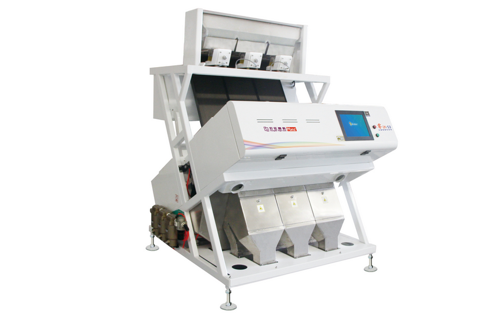

# Industrial robotic systems used for handling, sorting, packaging, and palletizing

## By Team Delta Nabla

Gr. 1543e/1

- Beno Tamás
- Barbor Ionut Catalin
- Lazar Mihai

---

# Feeding machines

## For chess pieces

---

# Feeding machines

## For chess board or chess box

---

# Conveyors

## For both chess pices and packages

---

# Robots

## Delta robots

---

# Robots

## Serial Robots

---

# Sorting machines

---

# Box folding machine

---

# Box folding machine

---

# Paletizing machine

---

# Sinkwrapping machine

---

# Thank you!
